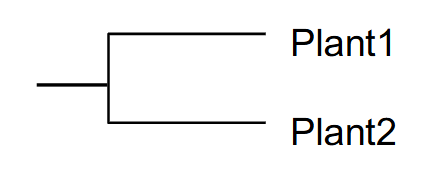
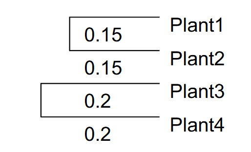
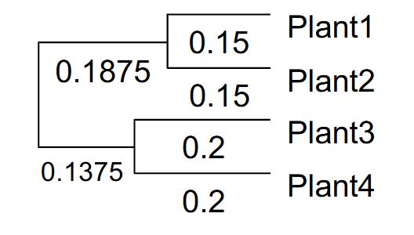

# Drawing first UPGMA trees

Now that you have thought about the biological meaning of relatedness, let’s start looking into the bioinformatic side of things.

<ol type="a" start="5">
  <li>
    Below, you see a multiple sequence alignment with (simulated) 18S rRNA gene sequences of six plants that are commonly consumed by humans (either in food, drinks, or by smoking). Can you think of a simple way to quantify the distance between the sequences?
  </li>
</ol>

<table>
  <thead>
    <tr>
      <th>Position:</th>
      <th>1</th>
      <th>7</th>
      <th>13</th>
      <th>19</th>
      <th>25</th>
      <th>31</th>
      <th>37</th>
      <th>43</th>
      <th>49</th>
      <th>55</th>
    </tr>
  </thead>
  <tbody>
    <tr>
      <td><b>Carica papaya</b> (Papaya)</td>
      <td>CTTGTA</td>
      <td>TCATAG</td>
      <td>ATTAAG</td>
      <td>CCATGC</td>
      <td>ATGTGT</td>
      <td>AAGTAT</td>
      <td>GAACTA</td>
      <td>ATTCAG</td>
      <td>ACTGTG</td>
      <td>AAACTG</td>
    </tr>
    <tr>
      <td><b>Passiflora edulis</b> (Passionfruit)</td>
      <td>CTTGTA</td>
      <td>TCATTT</td>
      <td>ATTAAG</td>
      <td>CCATTC</td>
      <td>ACGTGT</td>
      <td>AAGTAC</td>
      <td>GAACTA</td>
      <td>ATACGG</td>
      <td>ACTCTG</td>
      <td>GAACTG</td>
    </tr>
    <tr>
      <td><b>Brassica oleracea</b> (Broccoli)</td>
      <td>CTTGTA</td>
      <td>TCATAT</td>
      <td>AGTAAG</td>
      <td>CCATGC</td>
      <td>ATGTGT</td>
      <td>AATTAT</td>
      <td>GAACTA</td>
      <td>TTTCAG</td>
      <td>ACAGTT</td>
      <td>AAACTG</td>
    </tr>
    <tr>
      <td><b>Cannabis sativa</b> (Hemp)</td>
      <td>ATTGGA</td>
      <td>TCATAC</td>
      <td>ATTAAG</td>
      <td>CGATAC</td>
      <td>ATGTGA</td>
      <td>AAGTAT</td>
      <td>GAACAA</td>
      <td>ATTTTG</td>
      <td>ACTATG</td>
      <td>TAACTG</td>
    </tr>
    <tr>
      <td><b>Humulus lupulus</b> (Hops)</td>
      <td>ATTGGA</td>
      <td>TCATAA</td>
      <td>ATTAAG</td>
      <td>CGATAC</td>
      <td>ATGTGA</td>
      <td>AAGTAT</td>
      <td>GAACAA</td>
      <td>ATTTTG</td>
      <td>ACTATG</td>
      <td>TAACTG</td>
    </tr>
    <tr>
      <td><b>Manihot esculenta</b> (Tapioca)</td>
      <td>CTTGTA</td>
      <td>TCATTA</td>
      <td>CATAAG</td>
      <td>CCATTC</td>
      <td>ACGTGT</td>
      <td>AAGTAC</td>
      <td>GAACTA</td>
      <td>CTACGG</td>
      <td>ACTCTG</td>
      <td>GAACTG</td>
    </tr>
  </tbody>
</table>

<ol type="a" start="6">
  <li>
    Make an all-to-all distance matrix between the six plants. Note that distances are symmetric, so the distance Hemp -> Hops is the same as the distance Hops -> Hemp. Calculate the distance for the pairs Papaya -> Broccoli and Papaya -> Hemp. Take the rest of the values from Blackboard.  <em><strong>Tip:</strong> to move a row in a Word table you can do that by: Windows) Click into the row you want to move, press Shift+Alt (not AltGr) and press Up arrow/Down arrow; Mac) After selecting the row, click and hold until the row appears to rise off the table and drag it.</em>
  </li>
  <li>
    To make the UPGMA algorithm more easily understandable, we will illustrate the main steps using the small distance matrix below as an example (exercises <em>g</em> to <em>j</em>). (<em><strong>Tip:</strong> this is also illustrated in the following clip: <a href="https://www.youtube.com/watch?v=09eD4A_HxVQ">youtube.com/watch?v=09eD4A_HxVQ</a></em>.). Make sure you understand each step, and apply it to your alignment with six plant sequences.  First, start with the shortest distance between two species in the table and connect the two plants into a cluster. In our example, this is (Plant1, Plant2), like this:
  </li>
</ol>

<table>
  <thead>
    <tr>
      <th></th>
      <th>Plant1</th>
      <th>Plant2</th>
      <th>Plant3</th>
      <th>Plant4</th>
    </tr>
  </thead>
  <tbody>
    <tr>
      <td>Plant1</td>
      <td>0</td>
      <td><ins>0.3</ins></td>
      <td>0.9</td>
      <td>0.6</td>
    </tr>
    <tr>
      <td>Plant2</td>
      <td><ins>0.3</ins></td>
      <td>0</td>
      <td>0.5</td>
      <td>0.7</td>
    </tr>
    <tr>
      <td>Plant3</td>
      <td>0.9</td>
      <td>0.5</td>
      <td>0</td>
      <td>0.4</td>
    </tr>
    <tr>
      <td>Plant4</td>
      <td>0.6</td>
      <td>0.7</td>
      <td>0.4</td>
      <td>0</td>
    </tr>
  </tbody>
</table>
  

The UPGMA algorithm creates so-called “ultrametric” phylogenetic trees, which means that it assumes that all the organisms evolve with the same speed. According to this assumption, all evolutionary lineages follow the same molecular clock and every residue has the same probability of mutating in a given period of time. Therefore, if we consider any ancestral organism in the tree (ancestors are represented by an internal node) the total branch length from that node to any of the present-day organisms that descended from it is identical. In other words, the total branch length between any two organisms is the same as two times the branch length between each organism and their most recent ancestor, also known as their last common ancestor (LCA). For example: The distance Plant1 → Plant2 is x, so the branches Ancestor1,2 → Plant1 and Ancestor1,2 → Plant2 are both *x/2*. Calculate the length of the branches from the previous question and write them down below the branches.

<ol type="a" start="8">
  <li>
    Next, calculate the distance of your cluster (Plant1, Plant2) to the other plants, by calculating the average of the distances of Plant1 and Plant2 to each of the other plants. The result is a new distance matrix. For example: If the distance Plant1 → Plant3 is 0.9 and the distance Plant2 → Plant3 is 0.5, the distance (Plant1, Plant2) → Plant3 will be 0.7. <em><strong>Note:</strong> it is important for this averaging step to use the distances between individual organisms <strong>from the very first distance matrix</strong>. This is relevant in later stages of the algorithm: when you have already created several clusters and adjusted the distance matrix, averaging the distances of clusters that have already been averaged will lead to different (wrong!) results than averaging distances of individual organisms (correct!).</em>
  </li>
  <li>
    Find the shortest distance in the new distance matrix. Connect the two plants like before, calculate the branch lengths, and make a new distance matrix.
  </li>
  <li>
    When you join two clusters (or join a plant to a cluster), calculating the branch length becomes a little more complicated. The distance in the distance matrix always refers to the distance from leaf (=endpoint of a branch) to leaf. For example, the distance between the clusters (Plant1, Plant2) and (Plant3, Plant4) is 0.675, so the length of each branch should be 0.338. However, we have to take into account the branches we have already drawn. For our example, it would look like this:
  </li>
</ol>

<table>
  <thead>
    <tr>
      <th></th>
      <th>(Plant1, Plant2)</th>
      <th>Plant3</th>
      <th>Plant4</th>
    </tr>
  </thead>
  <tbody>
    <tr>
      <td>(Plant1, Plant2)</td>
      <td>0</td>
      <td>0.7</td>
      <td>0.65</td>
    </tr>
    <tr>
      <td>Plant3</td>
      <td>0.7</td>
      <td>0</td>
      <td><ins>0.4</ins></td>
    </tr>
    <tr>
      <td>Plant4</td>
      <td>0.65</td>
      <td><ins>0.4</ins></td>
      <td>0</td>
    </tr>
  </tbody>
</table>

<table>
  <tr>
    <td></td>
    <td>(Plant1, Plant2)</td>
    <td>(Plant3, Plant4)</td>
  </tr>
  <tr>
    <td>(Plant1, Plant2)</td>
    <td>0</td>
    <td><ins>0.675</ins></td>
  </tr>
  <tr>
    <td>(Plant3, Plant4)</td>
    <td><ins>0.675</ins></td>
    <td>0</td>
  </tr>
</table>

Follow the steps above until you have the placement and the branch lengths between all six plants.

[Go to module 3](03-UPGMA_interpretation.md)
